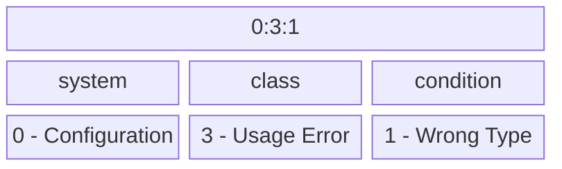

# LaunchDarkly Log Codes

## Introduction 

Log codes provide a standardized way to reference different log conditions across LaunchDarkly SDKs.

## Composition
Log codes are composed of 3 `specifiers` separated by a colon. The first specifier represents the affted `system` which categorizes the code by the components of the SDK in which the log condition occurs. The second specifier is the `class` of code this encodes the severity and type of action that may need to be taken. Lastly is the `condition`, which represents a specific condition within the specified system and class.

## Codes

### configuration

Conditions associated with SDK configuration.

#### 0:3:1 - wrongType

This message indicates that a configuration option was not of the correct type. This primarily applies to languages that are not strongly typed.

| code | system | class |
|------|--------|-------|
| 0:3:1 | configuration | usageError |

##### Message

`Config option "${name}" should be of type ${expectedType}, but received ${actualType}, using the default value (${defaultValue}).`

| parameter | description |
|-----------|-------------|
| actualType | The incorrect types used for the configuration option. |
| defaultValue | The default value of the configuration option. |
| expectedType | The correct type for the configuration option. |
| name | The name of the configuration option. |

### Troubleshooting

This is a step that you need to troubleshoot!
#### 0:3:2 - unknownOption

This message indicates that an unrecognized configuration option was provided. This primarily applied to languages that are not strongly typed.

| code | system | class |
|------|--------|-------|
| 0:3:2 | configuration | usageError |

##### Message

`Ignoring unknown config option "${name}"`

| parameter | description |
|-----------|-------------|
| name | The option that was not recognized. |

