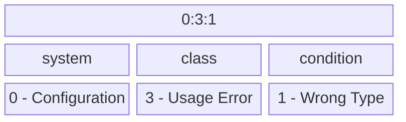

# LaunchDarkly Log Codes

## Introduction 

Log codes provide a standardized way to reference different log conditions across LaunchDarkly SDKs.

## Composition
Log codes are composed of 3 `specifiers` separated by a colon. The first specifier represents the affted `system` which categorizes the code by the components of the SDK in which the log condition occurs. The second specifier is the `class` of code this encodes the severity and type of action that may need to be taken. Lastly is the `condition`, which represents a specific condition within the specified system and class.

